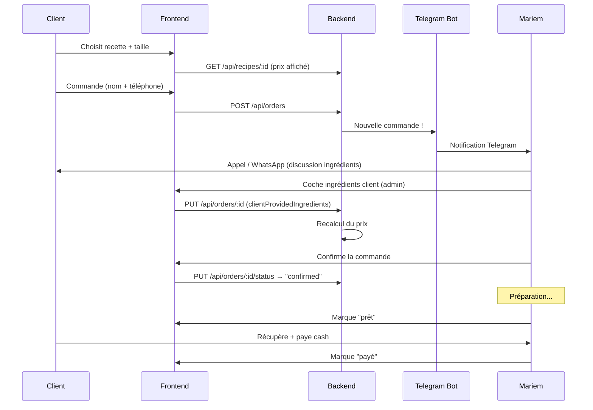

# Architecture Technique

## Vue d'ensemble

```
Client (visiteur)              Mariem (admin)
      │                              │
      ▼                              ▼
┌──────────────── Frontend (React) ──────────────────┐
│  Pages publiques    │    Pages admin (/admin/*)     │
│  - Recettes         │    - Gestion recettes         │
│  - Détail + prix    │    - Gestion commandes        │
│  - Commander        │    - Ingrédients / Machines   │
│                     │    - Paramètres                │
└─────────────────────┴──────────────────────────────┘
                      │
                      ▼
┌──────────────── Backend (Express) ──────────────────┐
│  API REST /api/*                                     │
│  - Auth JWT (admin uniquement)                       │
│  - CRUD recettes, ingrédients, machines              │
│  - Commandes + calcul de prix                        │
│  - Bot Telegram (notifications)                      │
└──────────────────────────────────────────────────────┘
                      │
                      ▼
┌──────────────── MongoDB ────────────────────────────┐
│  Collections : recipes, ingredients, appliances,     │
│  orders, users, settings                             │
└──────────────────────────────────────────────────────┘
```

L'admin est intégré dans le même frontend (routes `/admin/*` protégées par JWT), pas une app séparée.

## Stack technique

| Couche | Techno | Rôle |
|--------|--------|------|
| Frontend | React 18 + TypeScript + Vite | Interface client + admin |
| UI | Material-UI + Tailwind CSS | Composants + utilitaires |
| État | Redux Toolkit | Auth, panier |
| Backend | Node.js + Express + TypeScript | API REST |
| BDD | MongoDB + Mongoose | Persistance |
| Auth | JWT + bcrypt | Admin uniquement |
| Notifications | Telegram Bot API | Alertes commandes |
| Déploiement | Docker + Nginx | Production |

## Modèle de données

### Collection `ingredients`
```javascript
{
  _id: ObjectId,
  name: String,              // "Farine"
  pricePerUnit: Number,      // 0.8 (DT)
  unit: String,              // "kg", "g", "l", "ml", "pièce", "cuillère"
  category: String,          // "base" | "sweetener" | "dairy" | "flavoring" | "leavening" | "other"
  isActive: Boolean,
  createdAt: Date,
  updatedAt: Date
}
```

### Collection `appliances`
```javascript
{
  _id: ObjectId,
  name: String,              // "Four électrique"
  powerConsumption: Number,  // 2000 (Watts)
  category: String,          // "cooking" | "mixing" | "cooling" | "other"
  isActive: Boolean,
  createdAt: Date,
  updatedAt: Date
}
```

### Collection `recipes`
```javascript
{
  _id: ObjectId,
  name: String,              // "Gâteau au chocolat"
  description: String,
  images: [String],
  isActive: Boolean,
  category: String,          // "gâteau", "tarte", "biscuit", etc.

  // Tailles flexibles — chaque taille a ses propres quantités
  variants: [
    {
      sizeName: String,      // "Petit", "Moyen", "Grand", "2 étages", "12 pièces"
      portions: Number,      // 6
      ingredients: [
        {
          ingredientId: ObjectId,  // ref → ingredients
          quantity: Number,        // 200
          unit: String             // "g"
        }
      ],
      appliances: [
        {
          applianceId: ObjectId,   // ref → appliances
          duration: Number         // minutes d'utilisation
        }
      ]
    }
  ],

  createdAt: Date,
  updatedAt: Date
}
```

### Collection `orders`
```javascript
{
  _id: ObjectId,
  // Pas de userId — le client est un visiteur
  clientName: String,        // "Ahmed"
  clientPhone: String,       // "+21612345678"

  items: [
    {
      recipeId: ObjectId,    // ref → recipes
      variantIndex: Number,  // index dans recipes.variants (quelle taille)
      quantity: Number,      // combien de gâteaux

      // Ingrédients cochés par Mariem (fournis par le client)
      clientProvidedIngredients: [ObjectId],  // IDs des ingrédients que le client ramène

      // Prix calculé (mis à jour quand Mariem coche les ingrédients)
      calculatedPrice: {
        ingredientsCost: Number,
        electricityCost: Number,
        waterCost: Number,
        margin: Number,
        total: Number
      }
    }
  ],

  totalPrice: Number,
  status: String,            // "pending" | "confirmed" | "preparing" | "ready" | "paid" | "cancelled"
  notes: String,             // notes du client ou de Mariem
  createdAt: Date,
  updatedAt: Date
}
```

### Collection `settings`
```javascript
{
  _id: ObjectId,
  key: String,
  value: Number,
  // Paramètres configurables :
  // "stegTariff"       → 0.235 (DT/kWh)
  // "waterForfaitSmall" → 0.3 (DT)
  // "waterForfaitLarge" → 0.5 (DT)
  // "marginPercent"     → 15
}
```

### Collection `users`
```javascript
{
  _id: ObjectId,
  email: String,             // admin uniquement pour l'instant
  password: String,          // bcrypt hash
  firstName: String,
  lastName: String,
  role: String,              // "admin"
  isActive: Boolean,
  createdAt: Date,
  updatedAt: Date
}
```

## Calcul des prix

```
Pour une commande avec variant V et ingrédients cochés C :

ingredientsCost = Σ (ingrédient NOT IN C) → quantity × pricePerUnit
electricityCost = Σ (machine dans V) → (powerConsumption / 1000) × (duration / 60) × stegTariff
waterCost       = waterForfait (selon taille)
margin          = (ingredientsCost + electricityCost + waterCost) × marginPercent / 100
─────────────────────────────────────────────────────────────────────
total           = ingredientsCost + electricityCost + waterCost + margin
```

## Flux de commande



## Routes frontend

| Route | Page | Accès |
|-------|------|-------|
| `/` | Accueil — recettes populaires | Public |
| `/recipes` | Catalogue des recettes | Public |
| `/recipes/:id` | Détail recette + prix + commander | Public |
| `/auth/login` | Connexion admin | Public |
| `/admin` | Dashboard commandes | Admin (JWT) |
| `/admin/recipes` | Gestion des recettes | Admin |
| `/admin/recipes/new` | Créer une recette | Admin |
| `/admin/recipes/:id/edit` | Modifier une recette | Admin |
| `/admin/ingredients` | Gestion des ingrédients | Admin |
| `/admin/appliances` | Gestion des machines | Admin |
| `/admin/orders` | Gestion des commandes | Admin |
| `/admin/orders/:id` | Détail commande (cocher ingrédients) | Admin |
| `/admin/settings` | Paramètres (tarifs, marge) | Admin |
