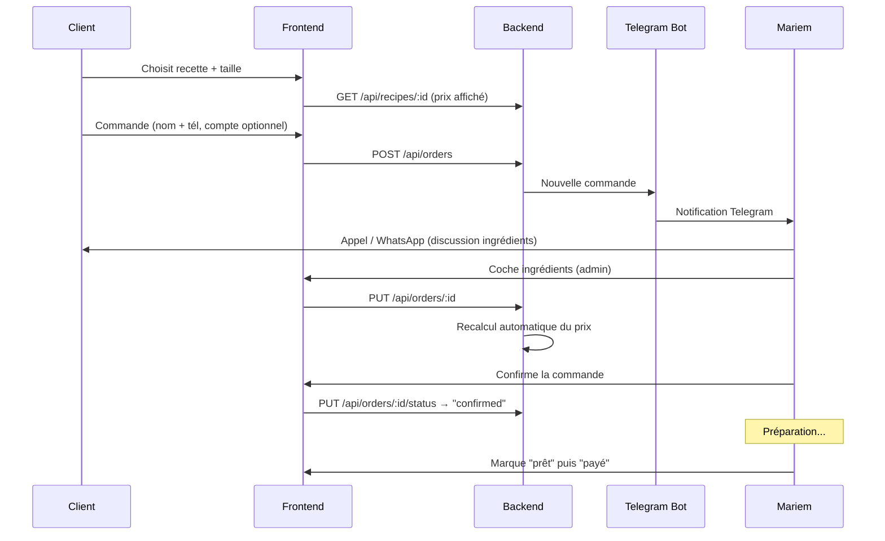

# Architecture technique

## Vue d'ensemble

```
┌─────────────────────────────────────────────────────────────────┐
│                     Internet (HTTPS)                            │
└──────────────┬───────────────────────────┬──────────────────────┘
               │                           │
       Client visiteur              Client connecté
       Mariem (admin)               (V1 optionnel)
               │                           │
               ▼                           ▼
┌─────────────────────────────────────────────────────────────────┐
│  Nginx (reverse proxy + SSL)                                    │
│    /api/*  ──────►  Backend (:3001)                             │
│    /      ──────►  Frontend (:3000)                             │
│    /uploads/*  ──►  fichiers statiques                          │
└─────────────────────────────────────────────────────────────────┘
               │                           │
               ▼                           ▼
┌─────────────────────────────┐  ┌───────────────────────────────┐
│  Frontend (React + Vite)    │  │  Backend (Express + TS)       │
│  Pages publiques            │  │  API REST /api/*               │
│  - /                         │  │  Auth JWT (admin + client)     │
│  - /recipes, /recipes/:id    │  │  CRUD recettes/ingrédients/    │
│  - /order/:id (suivi guest)  │  │       machines/commandes       │
│  Pages compte (optionnel)   │  │  Calcul de prix (service)      │
│  - /auth/login, /auth/register│  │  Upload images                │
│  - /mes-commandes            │  │  Bot Telegram (notifications)  │
│  Pages admin /admin/*       │  │  Rate-limit (global + auth)    │
└─────────────────┬───────────┘  └──────────────┬────────────────┘
                  │                             │
                  └──────────┬──────────────────┘
                             ▼
                  ┌──────────────────────┐
                  │  MongoDB             │
                  │  users, recipes,     │
                  │  ingredients,        │
                  │  appliances, orders, │
                  │  settings            │
                  └──────────────────────┘
```

L'admin est intégré au même frontend (routes `/admin/*` protégées par JWT), pas une app séparée. Les comptes clients réutilisent la même infrastructure auth avec un rôle distinct.

## Stack technique

| Couche | Techno | Rôle |
|--------|--------|------|
| Frontend | React 18 + TypeScript + Vite | Interface client + admin |
| UI | Material-UI v5 + Tailwind CSS | Composants + utilitaires |
| État | Redux Toolkit | Auth, panier, recettes |
| Routing | React Router v6 | Navigation |
| Backend | Node.js 18 + Express + TypeScript | API REST |
| BDD | MongoDB 6 + Mongoose | Persistance |
| Auth | JWT + bcrypt (12 rounds) | Admin et client |
| Sécurité | helmet, cors, express-rate-limit | Hardening |
| Logging | Winston + morgan | Logs applicatifs et HTTP |
| Notifications | Telegram Bot API | Alertes commandes |
| Upload | Multer | Images recettes |
| Déploiement | Docker + Nginx + Let's Encrypt | Production |
| CI/CD (prévu) | GitHub Actions | Tests + build + déploiement |

## Modèle de données

### Collection `users`
```ts
{
  _id: ObjectId,
  email: string,                  // unique
  password: string,               // bcrypt hash
  firstName: string,
  lastName: string,
  phone: string,                  // format tunisien (+216|0)[0-9]{8}
  role: 'admin' | 'client',       // rôle détermine les permissions
  isActive: boolean,
  lastLogin?: Date,
  createdAt: Date,
  updatedAt: Date
}
```

Les clients avec compte ont `role = 'client'`. Mariem a `role = 'admin'`. L'endpoint `/api/auth/register` crée **toujours** un rôle `client` — impossible de s'auto-promouvoir admin.

### Collection `ingredients`
```ts
{
  _id: ObjectId,
  name: string,                   // "Farine"
  pricePerUnit: number,           // 0.8 (DT)
  unit: string,                   // kg|g|l|ml|piece|cuillere|tasse
  category: string,               // base|sweetener|dairy|flavoring|leavening|other
  isActive: boolean,
  lastPriceUpdate?: Date,
  createdAt: Date,
  updatedAt: Date
}
```

### Collection `appliances`
```ts
{
  _id: ObjectId,
  name: string,                   // "Four électrique"
  powerConsumption: number,       // 2000
  unit: 'W' | 'kW',
  category: string,               // cooking|mixing|cooling|other
  isActive: boolean,
  createdAt: Date,
  updatedAt: Date
}
```

### Collection `recipes`
Chaque recette a plusieurs `variants` (tailles), chacun avec ses propres ingrédients et machines.

```ts
{
  _id: ObjectId,
  name: string,
  description: string,
  images: string[],
  category: string,
  isActive: boolean,
  variants: [
    {
      sizeName: string,           // "Petit", "Grand", "12 pièces"
      portions: number,
      ingredients: [
        { ingredientId: ObjectId, quantity: number, unit: string }
      ],
      appliances: [
        { applianceId: ObjectId, duration: number }   // minutes
      ]
    }
  ],
  createdAt: Date,
  updatedAt: Date
}
```

### Collection `orders`
```ts
{
  _id: ObjectId,
  clientId?: ObjectId,            // V1: optionnel (lien vers users si connecté)
  clientName: string,             // requis même en guest
  clientPhone: string,            // requis même en guest
  items: [
    {
      recipeId: ObjectId,
      variantIndex: number,
      quantity: number,
      clientProvidedIngredients: ObjectId[],   // cochés par Mariem
      calculatedPrice: {
        ingredientsCost: number,
        electricityCost: number,
        waterCost: number,
        margin: number,
        total: number
      }
    }
  ],
  totalPrice: number,             // arrondi au millime (3 décimales)
  status: 'pending' | 'confirmed' | 'preparing' | 'ready' | 'paid' | 'cancelled',
  notes: string,
  createdAt: Date,
  updatedAt: Date
}
```

### Collection `settings`
```ts
{
  _id: ObjectId,
  key: 'stegTariff' | 'waterForfaitSmall' | 'waterForfaitLarge' | 'marginPercent',
  value: number,
  label?: string
}
```

Les clés autorisées sont whitelistées côté backend ([settings.ts](../backend/src/routes/settings.ts)) — toute autre clé est rejetée.

## Calcul des prix

```
Pour un variant V et ingrédients cochés C :

ingredientsCost = Σ (ingrédient NOT IN C) → quantité × pricePerUnit
electricityCost = Σ (machine dans V) → (powerConsumption / 1000) × (duration / 60) × stegTariff
waterCost       = waterForfaitSmall si portions ≤ 8, sinon waterForfaitLarge
margin          = (ingredientsCost + electricityCost + waterCost) × marginPercent / 100
─────────────────────────────────────────────────────────────────────
total           = ingredientsCost + electricityCost + waterCost + margin
```

Les tarifs `stegTariff`, `waterForfait*` et `marginPercent` viennent de la collection `settings`, modifiable par Mariem via l'admin.

Code : [priceCalculationService.ts](../backend/src/services/priceCalculationService.ts).

## Flux de commande



## Sécurité (V1)

Mesures en place :
- **JWT** avec secret fort (fail-fast au démarrage si `JWT_SECRET` < 32 caractères).
- **Hash bcrypt** 12 rounds pour les mots de passe.
- **Rate-limit** global `/api/*` (100 req/15 min) + strict `/api/auth/*` (5 tentatives/15 min anti brute-force).
- **Helmet** pour les en-têtes HTTP sécurisés.
- **CORS** restrictif (seuls les domaines autorisés).
- **Validation** des clés dans `/api/settings` (whitelist).
- **Rôle `client` forcé** à l'inscription — impossible de devenir admin sans passage direct en DB.
- **HTTPS** obligatoire en production (Let's Encrypt).
- **Soft delete** sur les entités critiques (`isActive: false`).
- **Arrêt gracieux** : le serveur ferme proprement les connexions HTTP et Mongo sur SIGTERM/SIGINT.

Voir [security.md](./security.md) pour le détail et les évolutions prévues.

## Routes frontend

### Publiques
| Route | Page | Accès |
|-------|------|-------|
| `/` | Accueil — recettes populaires | Public |
| `/recipes` | Catalogue | Public |
| `/recipes/:id` | Détail + prix + bouton commander | Public |
| `/order/:id` | Suivi de commande (avec tél) | Public |

### Compte client (V1, optionnel)
| Route | Page | Accès |
|-------|------|-------|
| `/auth/login` | Connexion (admin ou client) | Public |
| `/auth/register` | Création compte client | Public |
| `/mes-commandes` | Historique commandes | Client connecté |

### Admin
| Route | Page | Accès |
|-------|------|-------|
| `/admin` | Dashboard commandes | Admin |
| `/admin/recipes` | Gestion recettes | Admin |
| `/admin/recipes/new` | Créer recette (wizard 4 étapes) | Admin |
| `/admin/recipes/:id/edit` | Modifier recette | Admin |
| `/admin/ingredients` | Gestion ingrédients + mise à jour prix en masse | Admin |
| `/admin/appliances` | Gestion machines | Admin |
| `/admin/orders` | Liste commandes (filtres statut) | Admin |
| `/admin/orders/:id` | Détail commande + cocher ingrédients | Admin |
| `/admin/settings` | Paramètres (STEG, eau, marge) | Admin |

## Dépendances externes

| Service | Usage | Alternative de secours |
|---------|-------|------------------------|
| Telegram Bot API | Notifications à Mariem | Email (V2) |
| WhatsApp (lien wa.me/) | Contact direct Mariem | Appel téléphonique |
| Let's Encrypt | Certificat SSL | Renouvellement auto certbot |
| MongoDB Atlas (option) | BDD managée si pas de VPS | MongoDB Docker local |

## Arborescence

```
mariem-sweet-kitchen/
├── backend/
│   ├── src/
│   │   ├── config/          Connexion Mongo
│   │   ├── middleware/      auth, errorHandler
│   │   ├── models/          Mongoose schemas
│   │   ├── routes/          Endpoints Express
│   │   ├── services/        Logique métier (prix, Telegram)
│   │   ├── scripts/         seed
│   │   ├── utils/           logger
│   │   └── index.ts         Entrée
│   └── tests/               Jest (V1.5)
├── frontend/
│   ├── src/
│   │   ├── components/      UI réutilisable
│   │   ├── pages/           Routes
│   │   ├── services/        Clients API
│   │   ├── store/           Redux
│   │   └── App.tsx          Routing principal
├── shared/
│   └── types/               Types TS partagés
├── docs/                    Documentation
├── docker/
├── docker-compose.yml
└── package.json             Monorepo npm workspaces
```
